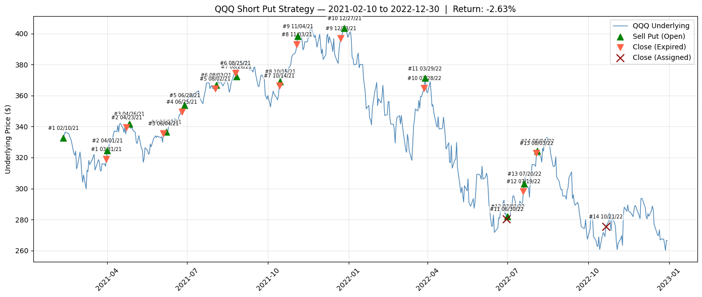
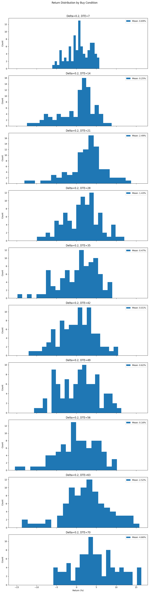
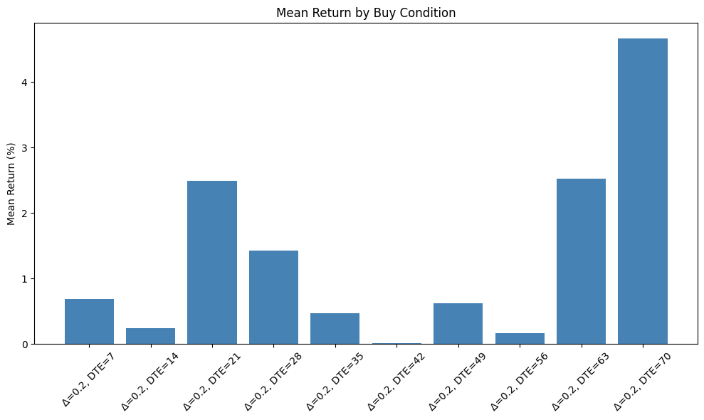

# Stock Options Backtester

A Python backtesting framework for systematic options strategies on QQQ (2020–2022). The engine supports configurable entry and exit conditions, grid search over delta/DTE parameter spaces, and a suite of visualisations for analysing return distributions and strategy performance across different market regimes.


## Currently implemented strategies

Following are the currently implemented strategies.

#### 1. Recurrent Short Put

The current implemented strategy is a **short put** (cash-secured put selling):
- Sell a put at a target delta and DTE each month
- Close at expiration
- Track premium P&L, assignment risk, and total return


## Roadmap

Planned features to extend the framework beyond the current short put strategy:

1. **Stop-loss / take-profit exit conditions** — close the short put early when the position has gained or lost a target percentage of the premium collected (e.g. close at 50% profit or 200% loss)
2. **Underlying technicals as entry/exit filters** — gate trades on momentum indicators (SMA crossovers, rate-of-change) or mean-reversion signals (RSI overbought/oversold) derived from the underlying price
3. **Short covered call** — after taking assignment on a short put, sell an OTM call against the acquired shares to collect additional premium while waiting for the stock to recover
4. **Wheel strategy** — combine the short put and covered call into a continuous cycle: sell puts until assigned, then sell covered calls until called away, then repeat
5. **Multi-ticker support** — extend the data pipeline to load and backtest across multiple underlyings (e.g. SPY, AAPL, TSLA) to evaluate strategy robustness beyond QQQ
6. **Underlying equity backtesting** — add support for trading the underlying stock directly (long/short entries based on technical signals) to compare equity strategies against options strategies on the same data
7. **Fundamental data as entry filters** — integrate earnings, P/E, revenue growth, or analyst rating signals as additional conditions to gate or size trades


## Data

### 1. QQQ Daily Option Chains — Kaggle

Source: [QQQ Daily Option Chains Q1 2020 – Q4 2022](https://www.kaggle.com/datasets/kylegraupe/qqq-daily-option-chains-q1-2020-to-q4-2022) (Kaggle)  
Place the CSV at `data/qqq_2020_2022.csv`.

- **Coverage:** QQQ only, 2020–2022
- **Format:** CSV with columns including `QUOTE_DATE`, `EXPIRE_DATE`, `DTE`, `STRIKE`, `P_LAST`, `C_LAST`, `P_DELTA`, `C_DELTA`, `UNDERLYING_LAST`

### 2. post-no-preference/options — DoltHub

Source: [post-no-preference/options](https://www.dolthub.com/repositories/post-no-preference/options) (DoltHub, license: CC BY-SA 4.0)  
Run a local Dolt SQL server and connect via `dolt.py`.

- **Coverage:** 2,274 US equity tickers, 2019-02-09 to 2026-05-12
- **Size:** ~107.8 million rows in `option_chain`
- **Tables:**
  - `option_chain` — bid, ask, vol, and greeks (delta, gamma, theta, vega, rho) per contract
  - `volatility_history` — current / week-ago / month-ago / year-ago IV high/low and historical variance (useful for IV rank)
- **Frequency:** weekdays for recent data; Mon/Wed/Fri for older data; weekly for oldest records

**Example rows (`option_chain`):**

| date | act_symbol | expiration | strike | call_put | bid | ask | delta | gamma | theta | vega |
|---|---|---|---|---|---|---|---|---|---|---|
| 2019-02-09 | NVDA | 2019-02-22 | 126.0 | Call | 22.85 | 23.60 | 0.9038 | 0.0087 | −0.1267 | 0.0495 |
| 2019-02-09 | NVDA | 2019-02-22 | 126.0 | Put | 0.91 | 0.99 | −0.0972 | 0.0088 | −0.1195 | 0.0499 |

To start the server (requires Dolt installed in WSL):
```bash
dolt sql-server   # listens on localhost:3306
```
Then run `dolt.py` from Windows to query it via the MySQL protocol.

## Grid Search

`grid_search()` in `backtest.py` sweeps over a list of buy conditions (delta / DTE combinations) and a list of start dates, running `execute_strategy` for every combination.  Results are collected as a list of result dicts and can be visualised with:

- `plot_grid_search_results()` — 2-D bubble chart (x = delta, y = DTE, bubble size ∝ |return|, colour = start date)
- `plot_return_distribution()` — stacked histograms of return (%) per buy condition, each with its mean annotated

Example: sweep 10 DTE values (7–70 days) at fixed delta 0.2 across ~90 weekly start dates (2021-02-10 → 2022-11-01).  Progress is printed to the console as `done/total  delta=… dte=… start=…`.

## Sample screenshots






## Structure

| File | Purpose |
|---|---|
| `lib.py` | Core library: data loading & cleaning, date helpers, option chain queries (`quote_at`, `quote_at_strike`), P&L computation (`compute_trade`), display utilities |
| `backtest.py` | Strategy engine: `execute_strategy`, `grid_search`, plotting functions (`plot_strategy`, `plot_grid_search_results`, `plot_return_distribution`) |
| `live-option-data.py` | Fetches live option chain data for experimentation |
| `test.py` | Unit tests for all `lib.py` helper functions |
| `data/` | Historical QQQ daily option chain data (not tracked in git) |
| `results/` | Output files from backtests and grid searches (not tracked in git) |


## Usage

Run a backtest:
```bash
python backtest.py
```

Profile performance:
```bash
kernprof -l -v backtest.py
```

Run tests:
```bash
python -m unittest -v test
```